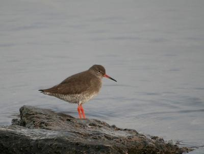

# U2NET on Gaudi 

<div style="display: flex;">
  
  
</div>

This repository aims to provide easy to run scripts for training of U2NET from scratch along with inferencing. 


## Dataset 
1. Make a directory data; with subdirectories as test_data and train_data 
2. Download and unzip the dataset 
    ```
    wget http://saliencydetection.net/duts/download/DUTS-TR.zip
    wget http://saliencydetection.net/duts/download/DUTS-TE.zip
    ```


## Training 
For getting started with training: 

1. Clone the repository 
2. Download the dataset 
3. Run the  training script: ```python train.py``` 


## Inferencing 
1. Run the script ```inference.py```


